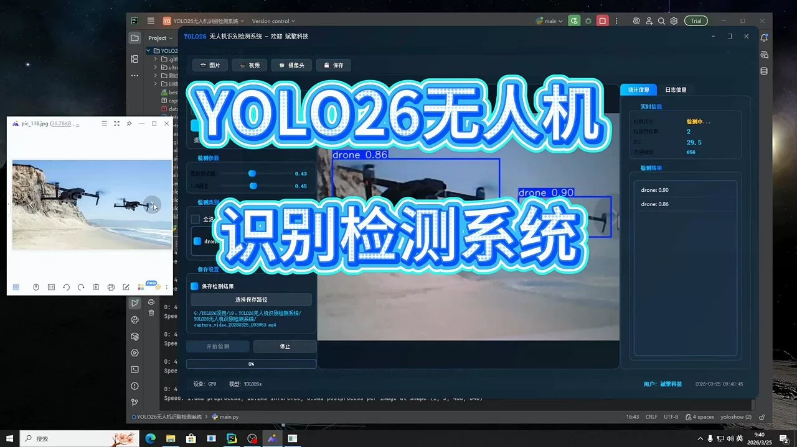
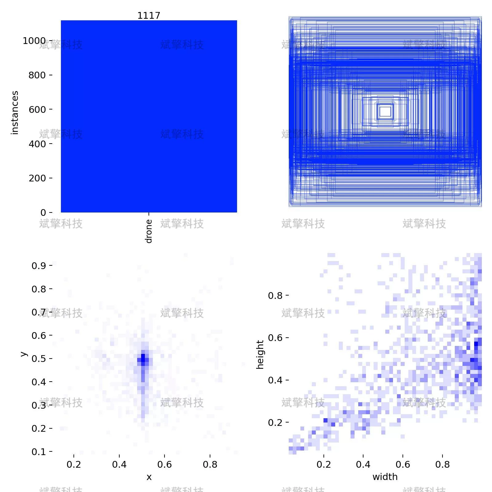
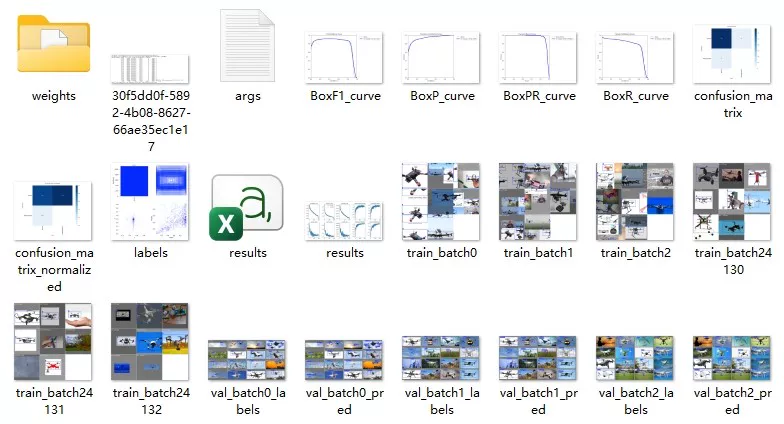
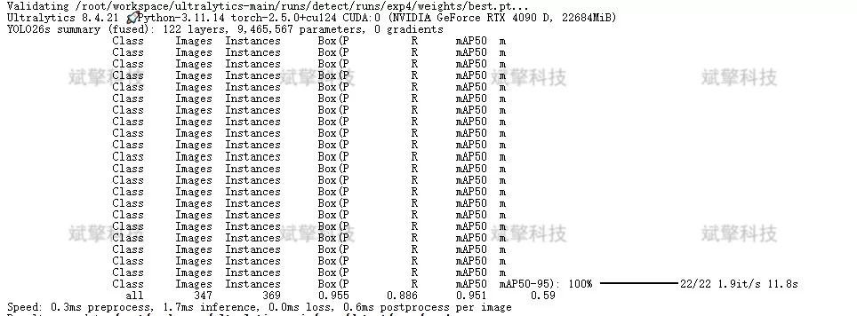
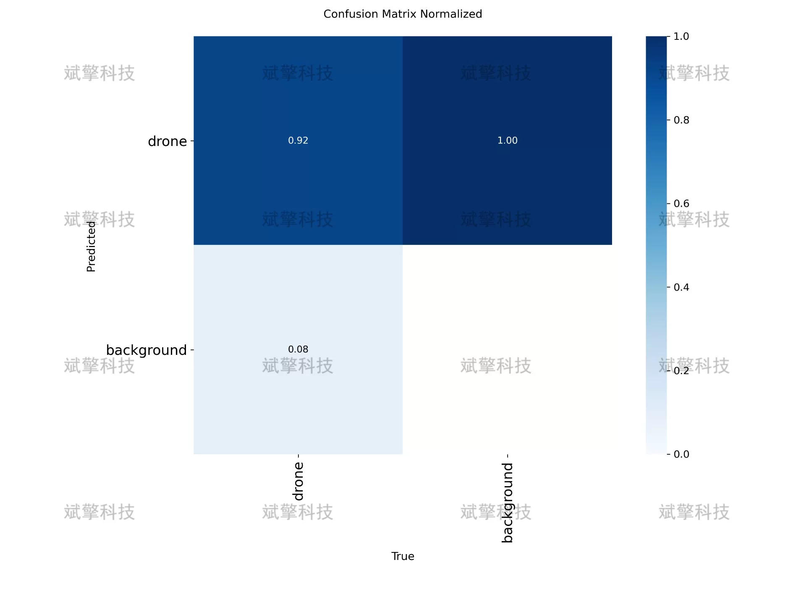
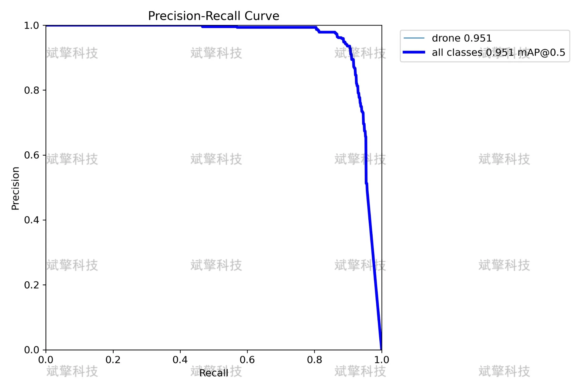
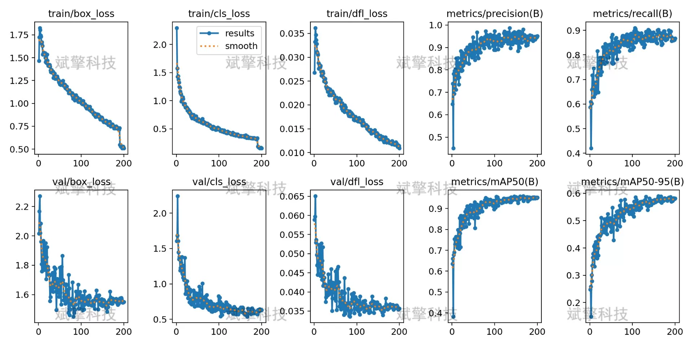
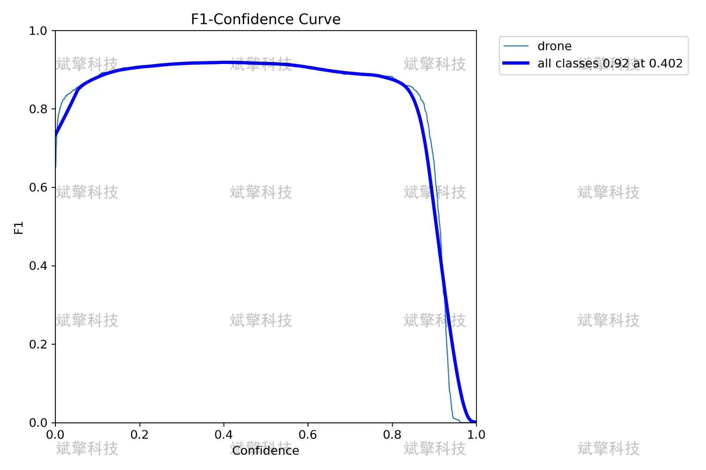
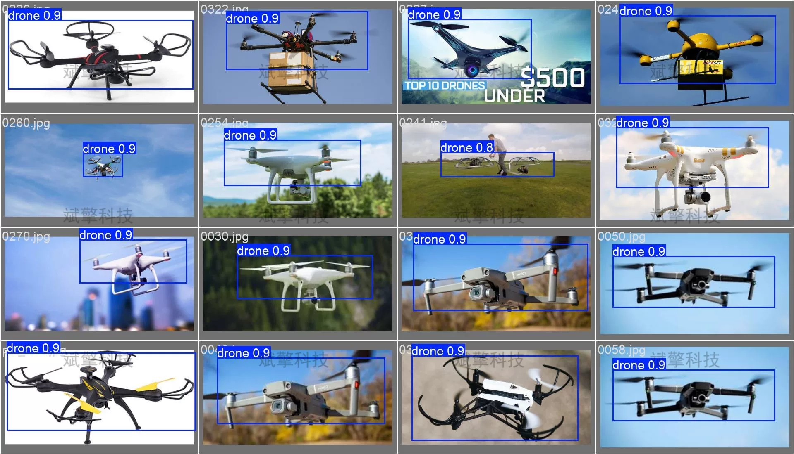

# YOLOv26 UAV Detection System | Model + Source Code

## Body

YOLO26 Drone Detection System | Model + Source Code Based on YOLO26 for Drone Detection: 95.1% mAP50 and 1.7ms Real-Time Inference. Full Process of Dataset Construction, Model Training, and Deployment

Drone recognition detection systems have important application value in low-altitude security, airspace management, and public safety. This study builds an automatic recognition detection system for drone targets based on the YOLO26 object detection algorithm. The system uses a dataset containing 1 class (drone) for training, with 1012 images in the training set and 347 images in the validation set.
Experimental results show that the model achieved 95.1% mAP50 on the validation set, with an accuracy rate of 95.5%, recall rate of 88.6%, and a best F1 score of 0.92. The model's inference speed is 1.7ms per image, meeting real-time detection requirements. The confusion matrix analysis shows that the model has a 100% accuracy rate in recognizing backgrounds, with no false alarms, but there is an approximately 8% missed detection rate for drone targets. Overall, the system maintains high precision while also providing good real-time performance, effectively applicable to actual drone monitoring scenarios.

Number of Classes    1 Class (drone)
Class Name    ['drone']
Training Set Size    1012 Images
Validation Set Size    347 Images
Annotation Format    YOLO format bounding box annotations

Free reservation for remote installation. Unsuccessful refund guaranteed.
Purchase Enjoy the following resources (auto unlocked in Baidu Cloud):
     YOLO Recognition Detection Project Complete Source Code
    ️ YOLO format datasets
      Training code + UI interface code
      Trained model + results images
      Software installer package
    ️ Add WeChat reservation for remote installation (automatically display WeChat ID after purchase) - Unsuccessful refund guaranteed

⚙️ Core Function Modules
Detection Capability
    Image Detection: Upon upload, return detection boxes + category information
    Video Detection: Supports video files, analyzes frames accurately
    Camera Real-Time Detection: Connects USB cameras for dynamic monitoring
Interaction and Control
    Target Selection: Choose one or more categories for detection
    Parameter Real-Time Adjustment: Adjustable confidence threshold & IoU threshold, flexible control of precision
    Result Save: One-click save of images/videos/camera detection results
System and Data
    User Login and Registration: Supports password strength checking + encryption storage
    Log Recording: Automate operation and error information recording (with timestamp)

## Images

## Payment

Here is a pay link on Stripe ( https://buy.stripe.com/3cs8yP7sY87d0vu9AB ). Please contact me lonlonago@foxmail.com after funding $89, and I will send you a complete data files , thank you!

